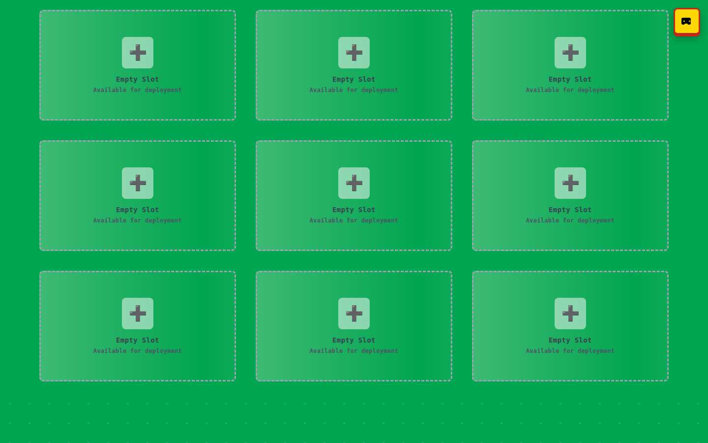

# LEGO Loco Cluster Design Guide

## Overview

This design guide documents the complete visual transformation of the LEGO Loco Cluster frontend interface, which has been redesigned to authentically capture the bright, playful aesthetic of the classic LEGO Loco game while providing a clean, modern user experience across all device types.

## Design Philosophy

The interface draws direct inspiration from two key visual elements of the original LEGO Loco game:

1. **Character Cards** - The red-bordered, yellow-accented character selection cards
2. **Start Screen** - The bright LEGO green baseplate background with railway grid pattern

The design implements a "clean and focused" approach with minimal UI elements, transparent headers, and authentic LEGO brick-style depth effects throughout.

## Color Palette

### Primary LEGO Colors
- **LEGO Green**: `#00A651` - Primary background, baseplate texture
- **LEGO Red**: `#C4281C` - Card borders, accent elements, frame styling  
- **LEGO Yellow**: `#FFD700` - Button accents, highlight borders, VR button
- **LEGO Blue**: `#0055BF` - Interactive elements, active states
- **LEGO White**: `#FFFFFF` - Text, button labels
- **LEGO Cream**: `#F5F5DC` - Card content backgrounds, name plates

### Supporting Colors
- **Deep Red Shadow**: `#a01e15` - 3D depth effects for red elements
- **Blue Dark**: `#003d8a` - Button shadow effects
- **Gray**: `#9CA3AF` - Empty slot borders, secondary text
- **Black**: `#000000` - Stream areas, text content

## Visual Elements

### Background Design
- **LEGO Baseplate Pattern**: Bright green background with subtle dot overlay simulating LEGO baseplate texture
- **Radial Gradient Dots**: Two-layer dot pattern for authentic LEGO surface feel
- **Color**: LEGO Green (`#00A651`) with white dot highlights

### Card Design Philosophy
Each instance card exactly replicates the visual style of LEGO Loco character cards:

- **Thick Red Frame**: 8px solid red border (`#C4281C`) 
- **Yellow Accent Border**: 4px inset yellow border (`#FFD700`)
- **3D Depth Effects**: Multiple layered box-shadows for authentic LEGO brick depth
- **Cream Content Area**: Light beige background (`#F5F5DC`) for readability
- **Metallic Name Plates**: Gradient-filled name plates with 3D border effects

## Instance Card States

The interface now displays all possible card states for comprehensive design review:

### Available States
1. **Active Ready** - Green status indicator, live stream with simulated LEGO Loco gameplay
2. **Active Running** - Blue status indicator, live stream with railway elements
3. **Booting** - Yellow status indicator with animated lightning bolt and progress bar
4. **Error** - Red status indicator with error icon and diagnostic message
5. **Not Provisioned** - Gray status with prohibition icon, non-functional
6. **Unknown Status** - Gray question mark icon for unidentified states
7. **Empty Slot** - Dashed border placeholder for available deployment slots

### Visual State Examples


*Desktop view showing all 6 instance states plus 3 empty slots in authentic LEGO Loco character card styling*

## Responsive Grid System

### Desktop Layout (1024px+)
- **Grid**: 3 columns (`lg:grid-cols-3`)
- **Spacing**: 40px gaps between cards (`lg:gap-10`)
- **Card Size**: Aspect ratio 16:9 maintained
- **Total Cards**: 9 cards in 3×3 grid arrangement
- **States Shown**: Active Ready (MARY), Active Running (PETER), Booting (LUCY), Error (JOHNNY), Not Provisioned (FRANK), Unknown (ANNA), plus 3 empty slots


### Laptop Layout (1440×900)
- **Grid**: 3 columns maintained
- **Spacing**: Scaled proportionally
- **Cards**: Slightly smaller but maintains aspect ratio



### Tablet Portrait (768×1024)
- **Grid**: 2 columns (`md:grid-cols-2`)
- **Spacing**: 32px gaps (`md:gap-8`)
- **Cards**: Larger individual cards with better touch targets
- **Layout**: All states displayed in 2-column responsive grid


### Tablet Landscape (1024×768)
- **Grid**: 3 columns (desktop layout)
- **Spacing**: Condensed for horizontal space
- **Cards**: Optimized for landscape viewing


### Mobile Portrait (375×812)
- **Grid**: 1 column (`grid-cols-1`)
- **Spacing**: 24px gaps (`gap-6`)
- **Cards**: Full-width cards for easy touch interaction
- **Stacked Layout**: All instance states displayed vertically


### Mobile Landscape (812×375)
- **Grid**: 2 columns for horizontal space optimization
- **Spacing**: Reduced for landscape constraints
- **Cards**: Compact layout maintaining functionality


## VR Mode Interface

### Updated LEGO Loco VR Theme
The VR interface has been completely redesigned to align with the authentic LEGO Loco visual language:

**🟩 LEGO Green Environment**
- Sky color changed from dark (`#111`) to bright LEGO green (`#00A651`)
- 3D baseplate grid pattern with white grid lines for authentic LEGO surface feel
- Spatial audio controls with LEGO-themed UI elements

**🔴 Authentic VR Card Design**
- VR tiles now use cream backgrounds (`#F5F5DC`) with red borders (`#C4281C`)
- Active tiles highlighted with LEGO yellow (`#FFD700`) and blue accents (`#0055BF`)
- Character names displayed prominently on each VR tile
- Double-bordered effect matching the 2D card design

**📱 Updated VR UI Elements**
- Info panel with LEGO-themed styling and emoji icons (`🎮 LEGO LOCO VR`)
- Yellow exit button (`🚪 Exit VR`) with red border matching main interface
- Volume controls (`🔊 Volume`) with clean white background and LEGO colors
- Instance selection menu (`🎯 Select Instance`) with authentic LEGO card styling


*VR interface now features bright LEGO green environment with baseplate grid pattern and authentic character card styling*

### VR Tile States
- **Connecting**: Shows character name with "Connecting..." status
- **Active**: Highlighted with yellow background and blue border
- **Inactive**: Cream background with red border
- **3D Depth**: Proper scaling and positioning for immersive experience

## UI Components

### Header Design
- **Style**: Completely transparent background
- **Height**: Minimal footprint (64px)
- **Content**: Single VR button in top-right corner
- **Removed Elements**: Title, subtitle, "Show All" toggle button

### VR Button
- **Style**: LEGO-style button with authentic yellow background
- **Border**: 3px red border (`#C4281C`)
- **Icon**: VR headset SVG icon (24×24px)
- **Position**: Fixed top-right corner
- **Effects**: 3D shadow with hover animations

### Instance Cards

#### Header Section
- **Background**: Yellow gradient (`from-yellow-200 to-yellow-100`)
- **Border**: 4px red bottom border (`border-red-700`)
- **Name Plate**: Metallic 3D effect with gray borders
- **Status Indicator**: 5px colored dot with LEGO color coding
- **Control Buttons**: Red (×) and Blue (?) mini-buttons with 3D effects

#### Content Area
- **Background**: Black for stream area (`#000000`)
- **Border**: 4px yellow border with 2px red inset
- **Aspect Ratio**: 16:9 maintained across all device sizes
- **Content**: VNC stream or placeholder with status indicators

#### Interactive States
- **Hover**: Slight lift effect (`translateY(-2px)`) with enhanced shadows
- **Active**: Blue ring with yellow accent and glow overlay
- **Loading**: Animated spinner with LEGO yellow accent

### Empty Slots
- **Background**: Semi-transparent cream (`rgba(245, 245, 220, 0.3)`)
- **Border**: Dashed gray border with blue hover state
- **Icon**: Plus symbol (➕) in gray
- **Animation**: Shimmer effect on hover

### Status Indicators
Color-coded status dots following LEGO theme:
- **Ready**: Green (`#22C55E`) with glow effect
- **Running**: LEGO Blue (`#0055BF`) with glow effect  
- **Booting**: LEGO Yellow (`#FFD700`) with pulse animation
- **Error**: Red (`#EF4444`) with glow effect
- **Unknown**: Gray (`#9CA3AF`) with subtle glow

## VR Interface

### VR Mode Design
- **Background**: Dark environment for VR comfort
- **Grid**: 3D positioned screens in virtual space
- **Controls**: Floating UI panels with LEGO styling
- **Navigation**: Spatial hand tracking and gaze controls


### VR Features
- **3D Grid Layout**: Instance screens positioned in 3D space
- **Hand Tracking**: Direct interaction with virtual elements
- **Spatial Audio**: Positioned audio for each instance
- **Exit Controls**: Floating "Exit VR" button with LEGO styling

## Animation System

### Card Animations
- **Entry**: Staggered fade-in with slide-up effect (0.1s delay per card)
- **Hover**: Scale and lift animation (`scale: 1.02, translateY: -2px`)
- **Tap**: Slight compression effect (`scale: 0.98`)
- **Active**: Smooth ring expansion with glow overlay

### Loading States
- **Spinner**: Yellow-accented circular loading indicator
- **Progress**: LEGO-style progress bar with yellow-to-red gradient
- **Shimmer**: Subtle cream-colored shimmer effect for empty slots
- **Pulse**: Status indicator breathing animation for booting state

### Transitions
- **VR Mode**: Full-screen fade transition with opacity animation
- **Card Focus**: Layout-aware border animation with `layoutId`
- **Responsive**: Smooth grid restructuring on screen size changes

## Typography

### Font System
- **Primary**: `SF Mono`, `Monaco`, `Inconsolata`, `Roboto Mono` (monospace)
- **Weight**: 600 (semibold) for body text, 700 (bold) for titles
- **Spacing**: 0.025em letter spacing for readability
- **Transform**: Uppercase for titles and labels

### Text Hierarchy
- **Card Titles**: 14px, bold, uppercase, LEGO text styling
- **Status Text**: 12px, semibold, colored by status
- **Descriptions**: 10px, normal weight, gray color
- **Buttons**: 14px, bold, contrasting colors

## Accessibility Features

### Color Contrast
- **Background/Text**: High contrast ratios maintained
- **Status Colors**: Distinct hues for colorblind accessibility
- **Focus States**: Clear blue focus rings on interactive elements

### Responsive Touch Targets
- **Minimum Size**: 44px touch targets on mobile devices
- **Spacing**: Adequate spacing between interactive elements
- **Visual Feedback**: Clear hover and active states

### Screen Reader Support
- **Alt Text**: Descriptive text for all visual elements
- **ARIA Labels**: Proper labeling for complex interfaces
- **Semantic HTML**: Proper heading hierarchy and button elements

## Technical Implementation

### CSS Framework
- **Base**: Tailwind CSS with PostCSS processing
- **Custom**: LEGO-specific CSS variables and classes
- **Animations**: Framer Motion for smooth interactions

### Component Structure
```
App.jsx
├── Header (transparent with VR button)
├── Grid Container (responsive 3×3 layout)
│   ├── InstanceCard (×9)
│   │   ├── Header (name plate + controls)
│   │   └── Content (VNC stream area)
│   └── EmptySlot (for unfilled positions)
└── VRScene (full-screen VR interface)
```

### Key CSS Classes
- `.lego-background` - Baseplate background pattern
- `.lego-card` - Character card styling with red frame
- `.lego-vr-button` - Yellow VR button with 3D effects
- `.lego-name-plate` - Metallic nameplate styling
- `.lego-status-*` - Color-coded status indicators

## Performance Considerations

### Image Optimization
- **Screenshots**: JPEG format with 50% quality for documentation
- **Icons**: SVG format for crisp scaling
- **Backgrounds**: CSS gradients instead of images where possible

### Animation Performance
- **Hardware Acceleration**: CSS transforms for smooth animations
- **Staggered Loading**: Prevents overwhelming initial load
- **Conditional Rendering**: VR mode only loads when activated

### Responsive Loading
- **Progressive Enhancement**: Mobile-first design approach
- **Lazy Loading**: VNC streams load on-demand
- **Efficient Re-renders**: React optimization with proper dependencies

## Future Design Considerations

### Planned Enhancements
- **Card Hover States**: Enhanced interactions with LEGO brick sounds
- **Advanced VR**: Hand tracking and spatial controls
- **Theme Variations**: Additional LEGO color schemes (Space, Castle, etc.)
- **Accessibility**: Enhanced screen reader support and keyboard navigation

### Maintenance Guidelines
- **Color Consistency**: Always use CSS variables for LEGO colors
- **Component Reuse**: Maintain consistent LEGO styling across new components
- **Documentation**: Update this guide when adding new visual elements
- **Testing**: Verify design across all documented device sizes

---

*This design guide documents the complete visual transformation implementing authentic LEGO Loco character card styling with clean, transparent header design and full responsive support across all device types and orientations.*