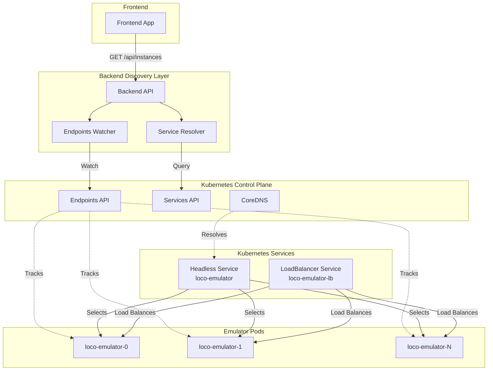

# Service Discovery Architecture Review & Refinement Plan

## Executive Summary

This document reviews the current service discovery implementation in `lego-loco-cluster` and proposes a Kubernetes-native architecture that leverages Services, Endpoints API, and modern Kubernetes features for resilient, fault-tolerant service discovery.

**Current State**: Direct Pod queries with static configuration fallback  
**Proposed State**: Service-based discovery with Endpoints API and health-aware routing  
**Target Runtime**: Minikube (with production-ready patterns)

---

## Current Architecture Analysis

### Implementation Overview

The current service discovery implementation (`backend/services/kubernetesDiscovery.js`) uses:

1. **Direct Pod Queries**: `listNamespacedPod()` with label selectors
2. **StatefulSet Metadata**: Queries StatefulSets for replica information
3. **Static Fallback**: ConfigMap-based instance configuration
4. **Pod Watch**: Real-time pod change notifications

### Identified Issues

#### 1. **API Response Handling**
- **Problem**: `podsResponse.body` returns `undefined` despite successful API calls
- **Root Cause**: Kubernetes client library version mismatch in response format
- **Impact**: Discovery fails silently, returning empty instance arrays

#### 2. **Tight Coupling to Pod Lifecycle**
- **Problem**: Direct dependency on Pod objects and their transient states
- **Impact**: 
  - Discovery breaks during rolling updates
  - No abstraction for pod replacement
  - Manual IP address management required

#### 3. **No Health-Aware Routing**
- **Problem**: Discovery doesn't respect pod readiness/liveness states
- **Impact**: Frontend may route to unhealthy instances

#### 4. **Static Configuration Dependency**
- **Problem**: Static ConfigMap used as primary data source for frontend
- **Impact**: 
  - Stale data during scaling events
  - Manual configuration updates required
  - Inconsistency between actual and configured state

#### 5. **Missing Service Abstraction**
- **Problem**: No use of Kubernetes Services as discovery intermediary
- **Impact**: 
  - Reinventing service discovery logic
  - No built-in load balancing
  - Complex failure handling

---

## Proposed Architecture: Kubernetes-Native Service Discovery

### Core Principles

1. **Services as Source of Truth**: Use Kubernetes Services for all discovery
2. **Endpoints API for Health**: Query Endpoints/EndpointSlices for ready instances
3. **Headless Service Pattern**: Maintain DNS-based discovery option
4. **Backend as Discovery Proxy**: Backend exposes unified API for frontend
5. **Static Config as UI Hint Only**: ConfigMap provides metadata, not addresses

### Architecture Diagram



### Key Components

#### 1. **Headless Service for Discovery**

```yaml
apiVersion: v1
kind: Service
metadata:
  name: loco-loco-emulator
  namespace: loco
spec:
  clusterIP: None  # Headless service
  selector:
    app.kubernetes.io/component: emulator
    app.kubernetes.io/part-of: lego-loco-cluster
  ports:
  - name: vnc
    port: 5901
    targetPort: 5901
  - name: health
    port: 8080
    targetPort: 8080
  publishNotReadyAddresses: false  # Only ready pods
```

**Benefits**:
- Automatic DNS records for each pod (`<pod-name>.<service-name>.<namespace>.svc.cluster.local`)
- Kubernetes manages endpoint updates automatically
- No manual IP tracking required

#### 2. **Endpoints API for Health-Aware Discovery**

Instead of querying Pods directly, query the Endpoints object:

```javascript
// New approach
const endpoints = await this.k8sApi.readNamespacedEndpoints({
  name: 'loco-loco-emulator',
  namespace: this.namespace
});

// Extract ready instances
const instances = [];
for (const subset of endpoints.body.subsets || []) {
  for (const address of subset.addresses || []) {
    instances.push({
      id: address.targetRef.name,
      ip: address.ip,
      hostname: address.hostname,
      ready: true,  // Only ready addresses are in 'addresses' array
      ports: subset.ports
    });
  }
}
```

**Benefits**:
- Kubernetes handles health checks
- Automatic removal of unhealthy instances
- Simpler API with guaranteed structure
- Built-in support for not-ready tracking

#### 3. **EndpointSlices for Scalability** (Kubernetes 1.21+)

For large-scale deployments:

```javascript
const endpointSlices = await this.k8sApi.listNamespacedEndpointSlice({
  namespace: this.namespace,
  labelSelector: 'kubernetes.io/service-name=loco-loco-emulator'
});

// Process slices
for (const slice of endpointSlices.body.items) {
  for (const endpoint of slice.endpoints) {
    if (endpoint.conditions.ready) {
      instances.push({
        id: endpoint.targetRef.name,
        addresses: endpoint.addresses,
        hostname: endpoint.hostname
      });
    }
  }
}
```

**Benefits**:
- Scales to thousands of endpoints
- More efficient than monolithic Endpoints
- Topology-aware routing support

#### 4. **Backend Discovery API**

New endpoint structure:

```javascript
// GET /api/instances/live
{
  "discoveryMode": "kubernetes-endpoints",
  "serviceName": "loco-loco-emulator",
  "namespace": "loco",
  "instances": [
    {
      "id": "loco-loco-emulator-0",
      "name": "Windows 98 - Game Server",
      "status": "ready",
      "addresses": {
        "podIP": "10.244.0.24",
        "dnsName": "loco-loco-emulator-0.loco-loco-emulator.loco.svc.cluster.local",
        "serviceEndpoint": "loco-loco-emulator.loco.svc.cluster.local:5901"
      },
      "ports": {
        "vnc": 5901,
        "health": 8080
      },
      "health": {
        "ready": true,
        "lastTransition": "2025-12-01T10:00:00Z"
      },
      "metadata": {
        "podName": "loco-loco-emulator-0",
        "nodeName": "minikube",
        "startTime": "2025-12-01T09:00:00Z"
      }
    }
  ],
  "summary": {
    "total": 9,
    "ready": 8,
    "notReady": 1,
    "lastUpdate": "2025-12-01T10:05:00Z"
  }
}
```

---

## Implementation Plan

### Phase 1: Service-Based Discovery (Minikube Mode)

#### 1.1 Update Helm Chart

**File**: `helm/loco-chart/templates/emulator-service.yaml`

```yaml
# Keep existing headless service, ensure publishNotReadyAddresses: false
spec:
  clusterIP: None
  publishNotReadyAddresses: false  # ADD THIS
```

**File**: `helm/loco-chart/values-minikube.yaml`

```yaml
# Add discovery mode configuration
backend:
  discoveryMode: "kubernetes-endpoints"  # Options: kubernetes-endpoints, kubernetes-pods, static
  serviceDiscovery:
    serviceName: "loco-loco-emulator"
    useEndpointSlices: false  # Set true for K8s 1.21+
    healthCheckInterval: 30000  # ms
```

#### 1.2 Create New Discovery Service

**File**: `backend/services/endpointsDiscovery.js`

```javascript
class EndpointsDiscovery {
  constructor(k8sApi, namespace, serviceName) {
    this.k8sApi = k8sApi;
    this.namespace = namespace;
    this.serviceName = serviceName;
    this.cachedEndpoints = null;
    this.lastUpdate = null;
  }

  async discoverInstances() {
    try {
      const endpoints = await this.k8sApi.readNamespacedEndpoints({
        name: this.serviceName,
        namespace: this.namespace
      });

      return this.parseEndpoints(endpoints.body);
    } catch (error) {
      logger.error('Failed to read endpoints', { error: error.message });
      return [];
    }
  }

  parseEndpoints(endpoints) {
    const instances = [];
    
    for (const subset of endpoints.subsets || []) {
      // Ready addresses
      for (const address of subset.addresses || []) {
        instances.push(this.createInstance(address, subset.ports, true));
      }
      
      // Not ready addresses (for monitoring)
      for (const address of subset.notReadyAddresses || []) {
        instances.push(this.createInstance(address, subset.ports, false));
      }
    }
    
    return instances;
  }

  createInstance(address, ports, ready) {
    const podName = address.targetRef?.name || 'unknown';
    const instanceNumber = this.extractInstanceNumber(podName);
    
    return {
      id: `instance-${instanceNumber}`,
      name: `Windows 98 - ${instanceNumber === 0 ? 'Game Server' : `Client ${instanceNumber}`}`,
      podName: podName,
      addresses: {
        podIP: address.ip,
        hostname: address.hostname,
        dnsName: `${podName}.${this.serviceName}.${this.namespace}.svc.cluster.local`
      },
      ports: this.mapPorts(ports),
      health: {
        ready: ready,
        lastTransition: new Date().toISOString()
      },
      status: ready ? 'ready' : 'not-ready',
      kubernetes: {
        namespace: this.namespace,
        nodeName: address.nodeName,
        targetRef: address.targetRef
      }
    };
  }

  mapPorts(ports) {
    const portMap = {};
    for (const port of ports || []) {
      portMap[port.name] = port.port;
    }
    return portMap;
  }

  extractInstanceNumber(podName) {
    const match = podName.match(/-(\d+)$/);
    return match ? parseInt(match[1]) : 0;
  }

  async watchEndpoints(callback) {
    const watch = new this.k8s.Watch(this.kc);
    
    return watch.watch(
      `/api/v1/namespaces/${this.namespace}/endpoints/${this.serviceName}`,
      {},
      (type, endpoint) => {
        logger.info('Endpoints changed', { type, service: this.serviceName });
        callback(type, endpoint);
      },
      (err) => {
        if (err && err.code !== 'ECONNRESET') {
          logger.error('Endpoints watch error', { error: err.message });
        }
      }
    );
  }
}

module.exports = EndpointsDiscovery;
```

#### 1.3 Update Instance Manager

**File**: `backend/services/instanceManager.js`

```javascript
const EndpointsDiscovery = require('./endpointsDiscovery');
const KubernetesDiscovery = require('./kubernetesDiscovery');

class InstanceManager {
  constructor(configDir) {
    this.configDir = configDir;
    this.discoveryMode = process.env.DISCOVERY_MODE || 'kubernetes-endpoints';
    
    // Initialize appropriate discovery service
    if (this.discoveryMode === 'kubernetes-endpoints') {
      this.discovery = new EndpointsDiscovery(
        k8sApi,
        namespace,
        process.env.EMULATOR_SERVICE_NAME || 'loco-loco-emulator'
      );
    } else {
      this.discovery = new KubernetesDiscovery();
    }
  }

  async getInstances() {
    try {
      const instances = await this.discovery.discoverInstances();
      
      // Enrich with static metadata if available
      return this.enrichWithMetadata(instances);
    } catch (error) {
      logger.error('Discovery failed', { error: error.message });
      return this.getFallbackInstances();
    }
  }
}
```

#### 1.4 Add RBAC Permissions

**File**: `helm/loco-chart/templates/rbac.yaml`

```yaml
# Add to existing Role
rules:
- apiGroups: [""]
  resources: ["endpoints"]
  verbs: ["get", "list", "watch"]
- apiGroups: ["discovery.k8s.io"]
  resources: ["endpointslices"]
  verbs: ["get", "list", "watch"]
```

### Phase 2: Frontend Integration

#### 2.1 Update Frontend API Client

**File**: `frontend/src/api/instances.js`

```javascript
export async function fetchLiveInstances() {
  const response = await fetch('/api/instances/live');
  const data = await response.json();
  
  return {
    instances: data.instances,
    discoveryMode: data.discoveryMode,
    summary: data.summary
  };
}

// Fallback to static config only for initial render
export async function fetchStaticInstances() {
  const response = await fetch('/api/config/instances');
  return response.json();
}
```

#### 2.2 Update Frontend State Management

```javascript
// Use live discovery as primary, static as fallback
const [instances, setInstances] = useState([]);
const [discoveryStatus, setDiscoveryStatus] = useState('loading');

useEffect(() => {
  async function loadInstances() {
    try {
      const { instances, summary } = await fetchLiveInstances();
      setInstances(instances);
      setDiscoveryStatus('live');
    } catch (error) {
      // Fallback to static for initial paint only
      const staticInstances = await fetchStaticInstances();
      setInstances(staticInstances);
      setDiscoveryStatus('static-fallback');
    }
  }
  
  loadInstances();
  const interval = setInterval(loadInstances, 5000);
  return () => clearInterval(interval);
}, []);
```

### Phase 3: Advanced Features

#### 3.1 Topology-Aware Routing

Use EndpointSlices with topology hints:

```javascript
// Prefer same-zone endpoints
const localEndpoints = endpointSlices.filter(slice => 
  slice.endpoints.some(ep => ep.zone === currentZone)
);
```

#### 3.2 Connection Pooling

Maintain persistent connections to ready endpoints:

```javascript
class ConnectionPool {
  constructor(endpoints) {
    this.connections = new Map();
    this.updateEndpoints(endpoints);
  }

  updateEndpoints(endpoints) {
    // Add new endpoints
    for (const ep of endpoints.filter(e => e.health.ready)) {
      if (!this.connections.has(ep.id)) {
        this.connections.set(ep.id, this.createConnection(ep));
      }
    }
    
    // Remove stale endpoints
    const activeIds = new Set(endpoints.map(e => e.id));
    for (const [id, conn] of this.connections) {
      if (!activeIds.has(id)) {
        conn.close();
        this.connections.delete(id);
      }
    }
  }
}
```

#### 3.3 Health Check Aggregation

Backend aggregates health from multiple sources:

```javascript
async function getInstanceHealth(instance) {
  return {
    kubernetes: instance.health.ready,
    httpHealth: await checkHttpHealth(instance.addresses.podIP, 8080),
    streamQuality: await getStreamQuality(instance.id),
    overall: computeOverallHealth()
  };
}
```

---

## Verification Plan

### Automated Tests

#### 1. **Unit Tests for EndpointsDiscovery**

**File**: `backend/tests/endpointsDiscovery.test.js`

```javascript
describe('EndpointsDiscovery', () => {
  it('should parse endpoints correctly', () => {
    const mockEndpoints = {
      subsets: [{
        addresses: [{ ip: '10.0.0.1', targetRef: { name: 'pod-0' } }],
        ports: [{ name: 'vnc', port: 5901 }]
      }]
    };
    
    const instances = discovery.parseEndpoints(mockEndpoints);
    expect(instances).toHaveLength(1);
    expect(instances[0].addresses.podIP).toBe('10.0.0.1');
  });
});
```

**Run**: `npm test -- endpointsDiscovery.test.js`

#### 2. **Integration Tests**

**File**: `backend/tests/integration/discovery.test.js`

```javascript
describe('Service Discovery Integration', () => {
  it('should discover emulator instances via endpoints', async () => {
    const manager = new InstanceManager('/tmp/config');
    const instances = await manager.getInstances();
    
    expect(instances.length).toBeGreaterThan(0);
    expect(instances[0]).toHaveProperty('addresses.dnsName');
  });
});
```

**Run**: `npm test -- integration/discovery.test.js`

### Manual Testing (Minikube)

#### Test 1: Verify Endpoints Discovery

```bash
# 1. Deploy with new discovery mode
helm upgrade loco ./helm/loco-chart \
  -f ./helm/loco-chart/values-minikube.yaml \
  --set backend.discoveryMode=kubernetes-endpoints \
  --namespace loco

# 2. Check backend logs for endpoints discovery
kubectl logs -n loco -l app=loco-loco-backend --tail=50 | grep -i endpoints

# Expected: "Discovered X instances via endpoints API"

# 3. Query backend API
kubectl port-forward -n loco svc/loco-loco-backend 3001:3001
curl http://localhost:3001/api/instances/live | jq

# Expected: JSON with instances array and discoveryMode: "kubernetes-endpoints"
```

#### Test 2: Verify Health-Aware Discovery

```bash
# 1. Scale emulators to 3
kubectl scale statefulset loco-loco-emulator -n loco --replicas=3

# 2. Wait for pods to be ready
kubectl wait --for=condition=ready pod -l app.kubernetes.io/component=emulator -n loco --timeout=300s

# 3. Query instances
curl http://localhost:3001/api/instances/live | jq '.summary'

# Expected: { "total": 3, "ready": 3, "notReady": 0 }

# 4. Manually mark one pod as not ready (simulate failure)
kubectl exec -n loco loco-loco-emulator-1 -- pkill -9 qemu

# 5. Wait 30 seconds for health check to fail

# 6. Query instances again
curl http://localhost:3001/api/instances/live | jq '.summary'

# Expected: { "total": 3, "ready": 2, "notReady": 1 }
```

#### Test 3: Verify Frontend Integration

```bash
# 1. Open frontend
open http://localhost:3000

# Expected: Dashboard shows "Auto-Discovery: kubernetes-endpoints (3 pods)"

# 2. Check browser console for discovery mode
# Expected: Console log showing discoveryMode: "kubernetes-endpoints"

# 3. Scale down to 1 replica
kubectl scale statefulset loco-loco-emulator -n loco --replicas=1

# 4. Wait 10 seconds and refresh frontend
# Expected: Dashboard updates to show 1 pod
```

---

## Migration Strategy

### Step 1: Feature Flag (Week 1)
- Implement `EndpointsDiscovery` alongside existing `KubernetesDiscovery`
- Add `DISCOVERY_MODE` environment variable
- Default to `kubernetes-pods` (current behavior)
- Test `kubernetes-endpoints` mode in development

### Step 2: Minikube Validation (Week 2)
- Switch Minikube deployments to `kubernetes-endpoints` mode
- Run full test suite
- Validate frontend updates correctly
- Monitor for edge cases

### Step 3: Production Rollout (Week 3)
- Update production Helm values to use `kubernetes-endpoints`
- Deploy with canary strategy (10% → 50% → 100%)
- Monitor discovery latency and accuracy
- Keep `kubernetes-pods` as emergency fallback

### Step 4: Cleanup (Week 4)
- Remove old `KubernetesDiscovery` pod-based logic
- Update documentation
- Remove `DISCOVERY_MODE` flag (endpoints become default)

---

## Benefits Summary

| Aspect | Current (Pod-based) | Proposed (Service-based) |
|--------|---------------------|--------------------------|
| **Reliability** | ❌ Breaks on API changes | ✅ Stable Endpoints API |
| **Health Awareness** | ❌ Manual health checks | ✅ Kubernetes-managed |
| **Scalability** | ⚠️ Works but inefficient | ✅ EndpointSlices for 1000+ pods |
| **Fault Tolerance** | ❌ No automatic failover | ✅ Auto-removes unhealthy |
| **Complexity** | ❌ High (custom logic) | ✅ Low (Kubernetes-native) |
| **DNS Integration** | ❌ Manual DNS construction | ✅ Automatic via headless service |
| **Load Balancing** | ❌ Client-side only | ✅ Service-level LB available |
| **Rolling Updates** | ❌ Requires careful handling | ✅ Seamless transitions |

---

## Risks & Mitigation

### Risk 1: Endpoints API Latency
**Mitigation**: Cache endpoints with 30s TTL, use watch for real-time updates

### Risk 2: Backward Compatibility
**Mitigation**: Feature flag allows gradual rollout, fallback to pod-based discovery

### Risk 3: DNS Resolution Overhead
**Mitigation**: Use IP addresses from Endpoints, DNS only for debugging

### Risk 4: EndpointSlices Complexity
**Mitigation**: Start with Endpoints API, migrate to EndpointSlices only if needed

---

## Next Steps

1. **Review & Approve**: Stakeholder review of this architecture plan
2. **Prototype**: Implement `EndpointsDiscovery` class
3. **Test**: Validate in Minikube environment
4. **Iterate**: Refine based on testing feedback
5. **Deploy**: Roll out to production with monitoring

---

## References

- [Kubernetes Services Documentation](https://kubernetes.io/docs/concepts/services-networking/service/)
- [Endpoints API Reference](https://kubernetes.io/docs/reference/kubernetes-api/service-resources/endpoints-v1/)
- [EndpointSlices](https://kubernetes.io/docs/concepts/services-networking/endpoint-slices/)
- [Headless Services](https://kubernetes.io/docs/concepts/services-networking/service/#headless-services)
