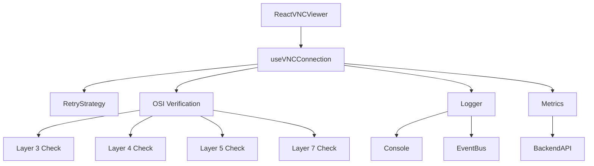

# Frontend Observability Subsystem

This document outlines the observability and reliability infrastructure implemented for the Lego Loco Cluster frontend.

## Overview

The frontend observability stack provides enterprise-grade diagnostics, metrics collection, and structured logging to ensure robust VNC connectivity and rapid troubleshooting.

## Components

### 1. Structured Logger (`utils/logger.js`)
- **Purpose**: Provides consistent, structured logging mirroring the backend's Winston format.
- **Features**:
  - Log levels: `debug`, `info`, `warn`, `error`.
  - Default level: `info` (mandatory logging).
  - Console output with color coding.
  - Dispatches `frontendLog` events for integration with metrics/backend.

### 2. Metrics Collector (`utils/metrics.js`)
- **Purpose**: Collects Prometheus-style metrics for health monitoring.
- **Metric Types**:
  - `Counters`: Monotonically increasing values (e.g., connection attempts).
  - `Gauges`: Instantaneous values (e.g., latency, frame rate).
  - `Histograms`: Statistical distributions (e.g., connection duration).
- **Reporting**: Auto-reports to backend `/api/metrics/frontend` every 30s.

### 3. Retry Strategy (`utils/retry.js`)
- **Purpose**: Handles transient failures with exponential backoff.
- **Logic**: `delay = base * 2^(attempt-1) + jitter`.
- **Configuration**: Customizable max attempts and base/max delays.

### 4. OSI Layer Verification (`utils/osiVerification.js`)
- **Purpose**: Diagnoses connection issues by verifying each network layer independently.
- **Layers**:
  - **Layer 3 (Network)**: Verifies API reachability (`/api/health`).
  - **Layer 4 (Transport)**: Verifies TCP connectivity to emulator via backend probes.
  - **Layer 5 (Session)**: Verifies WebSocket handshake and connection establishment.
  - **Layer 7 (Application)**: Verifies VNC protocol (RFB handshake) and capabilities.

## Usage

### Using the Hook
```javascript
import { useVNCConnection } from '../hooks/useVNCConnection';

const { state, connect, disconnect } = useVNCConnection(instanceId, {
  autoConnect: true,
  retryAttempts: 5
});
```

### OSI Diagnostics
The `state.diagnostics` object contains verification results:
```json
{
  "layer3": { "status": "ok", "latency": 45 },
  "layer4": { "status": "ok", "details": "TCP connected" },
  "layer5": { "status": "failed", "error": "WebSocket timeout" },
  "layer7": { "status": "skipped" }
}
```

## Architecture


